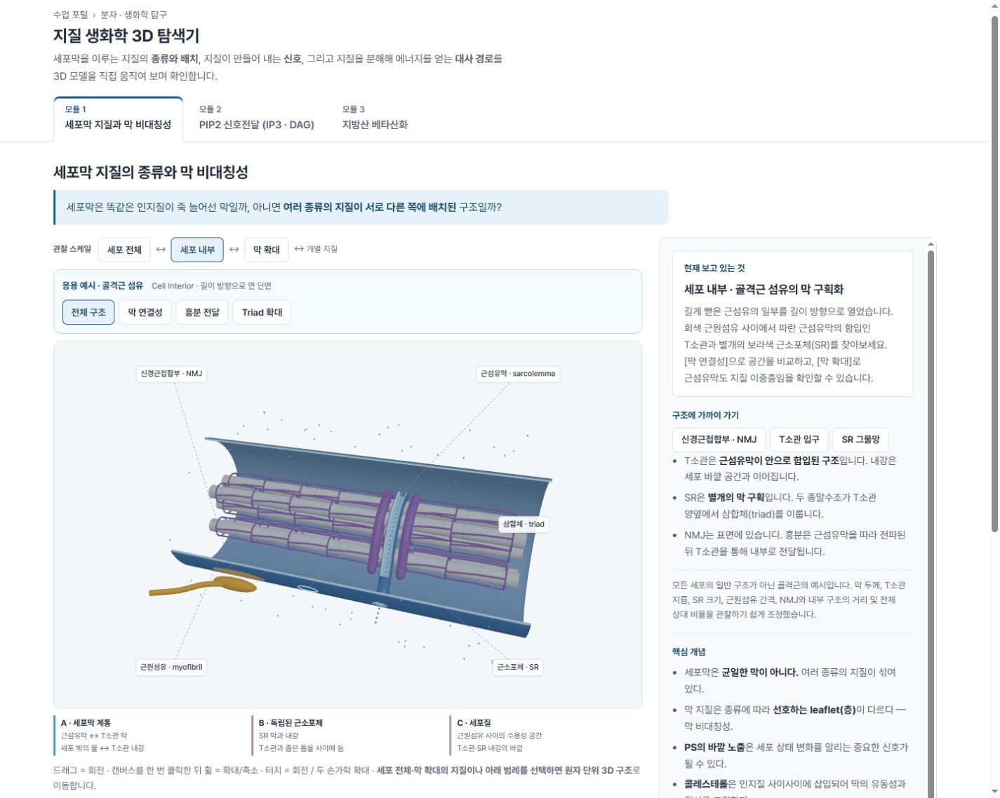
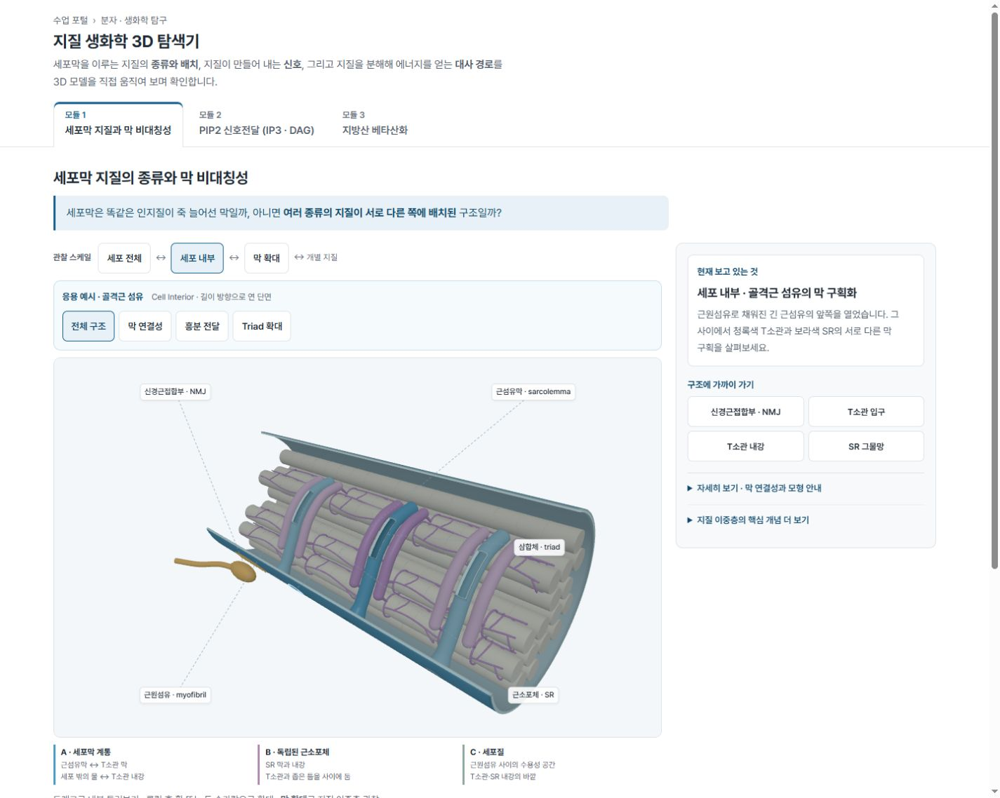

# Cell Interior 2차 고도화 · 검증 기록

2026-10-03 (Asia/Seoul). 기존 구현을 확장했으며 commit/push는 하지 않았습니다.

## 1. 수정 전 문제 진단

수정 전에 로컬 브라우저에서 전체 구조, 막 연결성, Triad 확대, 흥분 전달 중간 화면을 확인했습니다.
6개의 원섬유 사이로 빈 공간이 넓게 보이고, 모든 원섬유의 규칙적인 SR 고리가 철망처럼 읽혔습니다.
T소관은 실제로 빈 관이며 표면 입구도 열려 있었으나, 길이의 약 77%에 걸친 열린 벽이 긴 판처럼 보였습니다.
옆에 가까운 시점, 긴 설명 패널, 작고 길쭉한 신경 말단도 내부 공간감을 약화했습니다.

**수정 전, 1440×1150:**

**수정 후, 같은 viewport:**

뒤쪽 여러 층의 원섬유 끝면, 앞쪽 관찰 공간, 세 위치의 반복 triad가 함께 보입니다.
닫힌 원통 부분을 남긴 T소관과 짧은 어두운 관찰창이 판의 인상을 줄이고, 접힌 설명으로 장면이 우세해졌습니다.

## 2. 변경 파일

- `scripts/core/cell-interior.js`: 기존 생성기·모드 API 위에 밀도, SR, 반복 막 구간, 표지, 카메라, 강조 추가.
- `scripts/modules/membrane.js`: 내강 초점, 짧은 설명, 내부 장면 전용 FOV/레이아웃 연결.
- `styles/app.css`, `index.html`: 내부 장면의 화면 비율, 접힌 설명, 모바일 조작.
- `scripts/qa/check-interior.mjs`, `scripts/qa/check-interior-browser.mjs`, `scripts/qa/browser-metrics.js`: 기하·회귀·화면·측정 확대.
- `README.md`, `docs/SCIENTIFIC_NOTES.md`: 현재 수치와 단순화·연결성 설명.
- `docs/qa/interior-v2/`: 수정 전/후 캡처와 검증 기록.

공유 `viewer.js`, Whole Cell 생성기, 지질 생성기, Module 2/3 구현은 수정하지 않았습니다.

## 3. Myofibril density

6 → **16개**. Desktop/compact의 공간 배치는 같습니다. 엇갈린 격자에 작은 위치 변화를 주고,
외피 밖, 앞쪽 절개 방향, T소관 통로와 겹치는 후보를 제외했습니다. 서로 관통하지 않습니다.
원섬유 본체는 하나의 InstancedMesh이고 약한 띠도 한 batch입니다. 개수는 실제 생물학적 수량이 아닙니다.

## 4. Cutaway geometry

기존 길이 34·반지름 7, 둘레 **33.9% 절개**를 유지했습니다. 같은 방향의 원섬유를 생략하고
뒤쪽에는 여러 층을 남깁니다. 외피 절개 가장자리에는 실제 두께 면과 밝은 경계를 유지합니다.
세 외피 구간의 공통 경계는 동일한 각도 샘플을 사용하며 중간 접합면에는 불필요한 cap을 만들지 않습니다.
개별 원섬유를 단일 평면으로 정확하게 잘라낸 EM 표본의 재구성은 아닙니다.

## 5. SR network

관찰하기 좋은 원섬유 **4개**에 굽은 길이 방향 가지, 비스듬한 가로 연결, 종말수조로 갈수록
굵어지는 연결을 배치했습니다. 뒤쪽 SR은 가독성을 위해 생략합니다.
Desktop 2,628 / compact 1,776개 짧은 구간을 한 InstancedMesh로 묶었습니다.
독립 검증에서 SR과 원섬유의 관통 0건, 최소 표면 간격 약 **0.026 모형 단위**입니다.

## 6. T-tubule hollow geometry

안팎 벽과 실제 두께를 갖는 기존 관 생성기를 보존했습니다. 관의 약 **50–79% 길이 구간**에서만
앞 벽 일부를 열고 양쪽에는 완전한 원통 구간을 남겼습니다. 내강 반지름 0.38, 외벽 반지름 0.56,
일반 구간의 벽 두께 0.18입니다. 어두운 내강, 밝은 절개 테두리, 열린 끝의 고리가 단면을 구분합니다.
새로운 ‘T소관 내강’ 초점을 제공합니다.

## 7. Sarcolemma–T-tubule continuity

각 표면 입구와 관 벽이 같은 indexed geometry의 경계 정점을 공유합니다.
세 입구 모두 실제 triangle edge 공유와 입구 방향 ray 검사로 cap이 없음을 확인했습니다.
파란 표지는 세포 밖과 내강에서 **같은 크기·재질**을 사용하며 움직이지 않습니다.
막 연결성의 SR 내강 표지는 종말수조 안에만 존재하고, 이 모드의 반투명 막을 통해 보입니다.
세포질 표지는 원섬유·T소관·SR을 피한 공간에 놓입니다.

## 8. Repeated T-tubule / triad

길이 방향 **세 위치**(-5.6, 4.4, 12.4)에 열린 입구·T소관·양측 종말수조를 배치했습니다.
가운데 대표 triad를 선명하게 표시하고 나머지는 채도와 관 곡선 상세도를 낮췄습니다.
세 위치 모두 SR–T 막 사이 실제 간격은 최소 **0.34**입니다. SR은 T소관과 융합하지 않습니다.

## 9. NMJ

긴 말단을 둥근 bouton으로 바꾸고 운동종판과 마주보게 했습니다. 말단 표면과 종판 사이의
명시적 틈은 0.32입니다. 대표 triad와 축 방향 간격 14.5를 유지합니다.
6초 전파 강조는 NMJ → 표면의 이동 띠 → 여러 입구의 관 벽 강조 → 대표 triad/SR 순서이며,
빛과 고리는 전기 입자나 유체 흐름을 의미하지 않습니다.

## 10. Camera

수정 전 FOV42°/거리47/방위각0.34와 수정 후 FOV48°/거리39/방위각0.79를 실제 화면에서 비교했습니다.
최종 시점은 축 방향 끝면과 긴 내부를 함께 보이는 3/4 perspective입니다. 목표점은(-0.4,-1.2,0),
극각은1.12입니다. 초점별 입구·내강·SR·NMJ·triad 시점을 별도로 조정했습니다.
주변 구조의 색 대비를 낮추되 관계를 읽을 수 있도록 형상은 유지합니다.
다른 관찰 스케일에서는 기존 FOV42°로 복귀합니다.

## 11. UI / information panel

Desktop 내부 장면만 약70/30 비율로 바꾸었습니다. ‘현재 보고 있는 것’, 2문장 요약, 초점 버튼을
먼저 표시하고 원래 설명·개념·과학적 주의는 native details에 보존했습니다.
390/320px에서는 설명이 아래로 내려가며 캔버스 높이440px, 조작 버튼 최소44px입니다.
일반 지질 화면과 Module 2/3의 레이아웃은 유지합니다.

## 12. Draw calls / performance

최종 측정은 `after/browser-report.json`, 수정 전 측정은 `baseline-browser/browser-report.json`에 있습니다.

| 장면 | 수정 전 draw calls / triangles | 수정 후 draw calls / triangles | 최종 FPS / p95 간격 |
| --- | --- | --- | --- |
| Desktop 기본 | 25 / 149,944 | 39 / 234,032 | 300.0 / 3.5ms |
| Desktop Triad | 23 / 149,296 | 36 / 232,952 | 279.3 / 6.4ms |
| 390px 기본 | 25 / 69,132 | 39 / 123,800 | 294.7 / 4.8ms |

위 값은 실제 렌더된 프레임의 draw calls/triangles입니다. 숨긴 강조·표지를 포함한 전체 기하 검사에서는
Desktop 256,060 / compact 133,460 triangles입니다. 캔버스의 실제 내부 크기는 Desktop874×546,
390px 화면356×438입니다. 화면에 보이는 폴리곤 수는 모드와 frustum에 따라 달라집니다.

32개 mesh/16개 instance batch이며, 추가된 원섬유마다 개별 Mesh를 만들지 않습니다.
반복 관은 서로 다른 외피 구간의 실제 입구를 포함하므로 독립 indexed mesh 3개를 사용합니다.
대표 관보다 반복 관의 길이 방향 subdivision을 낮추고, compact에서는 SR 구간과 원형 단면 해상도를 줄입니다.
SR 표지와 물 표지는 InstancedMesh이며 모드 전환마다 geometry나 instance buffer를 재생성하지 않습니다.

Chrome headless, 데스크톱1440×1150과 터치·viewport를 모사한390×844에서 실제 RAF 간격을 측정합니다.
30프레임 warm-up 뒤120프레임 표본입니다. 물리적 휴대폰 측정이나 GPU 시간 측정은 아니며,
브라우저 스케줄링·다른 실행 부하에 영향을 받으므로 서로 다른 실행의 FPS를 속도 개선율로 해석하지 않습니다.

## 13. Desktop/mobile screenshot QA

실제 브라우저 캡처를 열어 확인한 판정입니다. 회전 및 확대는 사용자가 자유롭게 바꿀 수 있습니다.

| 요청 화면 | 판정 | 증거 |
| --- | --- | --- |
| 01 기본 Cell Interior | PASS | [기본](after/desktop-01-interior.png) |
| 02 약30° 회전 | PASS | [회전](after/desktop-02-rotated.png) |
| 03 반대 방향 회전 | PASS | [반대 회전](after/desktop-03-opposite-rotation.png) |
| 04 axial-looking | PASS | [축 방향](after/desktop-04-axial-looking.png) |
| 05 막 연결성 | PASS | [A/B/C](after/desktop-05-continuity.png) |
| 06 T소관 입구 | PASS | [실제 입구](after/desktop-06-tubule-opening.png) |
| 07 T소관 내강 | PASS | [짧은 관찰창](after/desktop-07-tubule-lumen.png) |
| 08 SR network | PASS | [SR](after/desktop-08-sr-network.png) |
| 09 NMJ | PASS | [표면 접합](after/desktop-09-nmj.png) |
| 10 Triad | PASS | [세 막의 간격](after/desktop-10-triad.png) |
| 11 흥분 전달 중간 frame | PASS | [관 벽 강조](after/desktop-11-excitation-middle.png) |
| 12 설명 접기/펼치기 | PASS | [접기](after/desktop-12-panel-collapsed.png), [펼치기](after/desktop-12-panel-expanded.png) |
| 13 내부→막 확대 | PASS | [접근](after/desktop-13-interior-to-patch.png), [결과](after/desktop-patch-result.png) |
| 14 모바일390 기본 | PASS | [기본](after/mobile-14-interior.png) |
| 15 모바일390 controls | PASS | [조작](after/mobile-15-controls.png) |
| 16 모바일390 T소관 | PASS | [입구](after/mobile-16-tubule-opening.png) |
| 17 모바일390 Triad | PASS | [Triad](after/mobile-17-triad.png) |
| 18 모바일390 설명 | PASS | [설명](after/mobile-18-information.png) |
| 추가320 기본/Triad/설명 | PASS | [기본](after/mobile-320-interior.png), [Triad](after/mobile-320-triad.png), [설명](after/mobile-320-information.png) |

| 시각 판정 항목 | 결과 | 관찰 |
| --- | --- | --- |
| 원섬유가 충분히 많아 밀집됨 | PASS | 16개, 여러 깊이 층과 끝면 |
| Cutaway로 내부 관찰 가능 | PASS | 앞쪽 관찰 공간과 중앙 막계 |
| 뒤쪽에도 구조가 있어 깊이가 보임 | PASS | 기본·축 방향 모두 확인 |
| 6개의 큰 막대처럼 보이지 않음 | PASS | 작은 원섬유가 단면을 채움 |
| SR이 사각 철망처럼 보이지 않음 | PASS | 굽은 가지·비스듬한 연결 |
| SR이 무작위 spaghetti처럼 보이지 않음 | PASS | 선택한 원섬유 둘레에 조직됨 |
| T소관이 plate처럼 보이지 않음 | PASS | 관찰창 양쪽의 온전한 관 벽 |
| T소관이 hollow tube로 보임 | PASS | 어두운 내강과 두께 경계 |
| 표면 opening 확인 | PASS | 입구 초점의 실제 열린 함입 |
| 외부와 T 내강 연속성 | PASS | 같은 정적 표지와 연속된 입구 |
| T와 SR이 융합돼 보이지 않음 | PASS | 양측 실제 틈 |
| Triad가 단일 특수 장치처럼 보이지 않음 | PASS | 세 반복 위치 |
| NMJ가 sarcolemma와 마주보는 구조 | PASS | bouton·종판·좁은 틈 |
| NMJ와 triad가 직접 연결돼 보이지 않음 | PASS | 축 방향 분리, 연결 관 없음 |
| 기본 카메라의 내부 depth | PASS | 가까운 단면과 먼 내부 동시 노출 |
| 3D가 설명 패널보다 우세함 | PASS | 약70/30, 설명 기본 접힘 |
| 화면이 과도하게 복잡하지 않음 | PASS | SR4개만 강조, 기본 물 표지 숨김 |
| Whole Cell 정상 | PASS | 단면·PS·비대칭성 |
| Membrane patch 정상 | PASS | 모드·실제 지질 picking |
| 지질3D/2D 정상 | PASS | 7종 모두 전환 |
| Module2/3 정상 | PASS | 단계 조작·비교·Reset |

## 14. Scientific topology 검증

| 관계 | 판정 / 근거 |
| --- | --- |
| T소관은 sarcolemma 함입 | PASS · 세 입구의 공유 정점/삼각형 edge |
| T 내강은 extracellular와 연속 | PASS · 열린 입구 ray 검사/동일 표지 |
| T 내강은 cytosol이 아님 | PASS · 내강 표지와 세포질 표지의 기하 분리 |
| SR은 별개 membrane system | PASS · 독립 geometry, T벽과 모든 SR 구간 분리 |
| SR이 myofibril 주변 | PASS · 선택 원섬유4개 사방을 둘러쌈/관통 없음 |
| 종말수조는 SR 확장부 | PASS · 연결 가지의 반지름이 증가하며 수조에 닿음 |
| Triad에서 양측 종말수조 | PASS · 세 위치 모두 두 수조/최소0.34 틈 |
| NMJ는 sarcolemma 표면 | PASS · 종판 정점이 외피 표면을 따름 |
| NMJ–triad 직접 관 연결 없음 | PASS · 대표 부위 축 방향14.5 분리 |

생물학적 근거와 교육용 단순화 범위는 [SCIENTIFIC_NOTES](../../SCIENTIFIC_NOTES.md)에 기록했습니다.

## 15. Regression test

- `node scripts/qa/check-cell.mjs`: Whole Cell 배치·PS 보존·단면·picking·회전·pinch·전환 잠금.
- `node scripts/qa/check-interior.mjs`: 모든 입구·막 간격·원섬유/SR 배치·정적 표지·모드·기하/버퍼 재사용.
- `node scripts/qa/check-molecules.mjs`: 7종 대표 지질의 분자 구조.
- `node scripts/qa/check-interior-browser.mjs`: 실제 화면·모든 관찰 스케일·지질3D/2D·Module2/3·모바일·reduced-motion·오류 수집.
- `git diff --check`: 공백 오류 점검.

검증 중 로컬 서버 종료로 한 번 네트워크 오류가 발생했습니다. 서버를 다시 실행하고 최종 전체 브라우저 검사를 재실행했습니다.
**최종 결과: 위 세 Node 검사 PASS, 브라우저 22개 검사 PASS / 28장 캡처 / errors=[], 공백 점검 PASS.**
FOV48→42 복귀, 7종 지질 전환, reduced-motion, 표지의 정지 상태, 두 외피 접합면의 동일 tessellation도 확인했습니다.

## 16. 남아 있는 한계

- 실제 조직의 크기·수량·색·간격을 재현한 EM 모델이 아닙니다. 공간 관계와 막의 연결성을 학습하는 모형입니다.
- SR은 선택적 절차 생성 표현이며, 뒤쪽의 모든 망과 단백질 수준 구조는 생략합니다.
- T소관 관찰창과 표본 끝의 열린 단면은 가상의 절개입니다. Cytosol로 열리는 생물학적 통로가 아닙니다.
- 회전·확대에 따라 표본 끝 일부가 화면 밖으로 나갈 수 있습니다. Reset과 줌으로 다시 프레이밍할 수 있습니다.
- 성능은 이 컴퓨터의 Chrome 측정입니다. 390/320px 검증은 모바일 viewport와 터치 모사이며 실제 저사양 휴대폰의 GPU 검증은 아닙니다.
- 물 표지와 6초 막 강조는 공간·순서를 설명합니다. 유체 흐름, 이온 농도, 전기생리 또는 수축 시뮬레이션은 없습니다.
