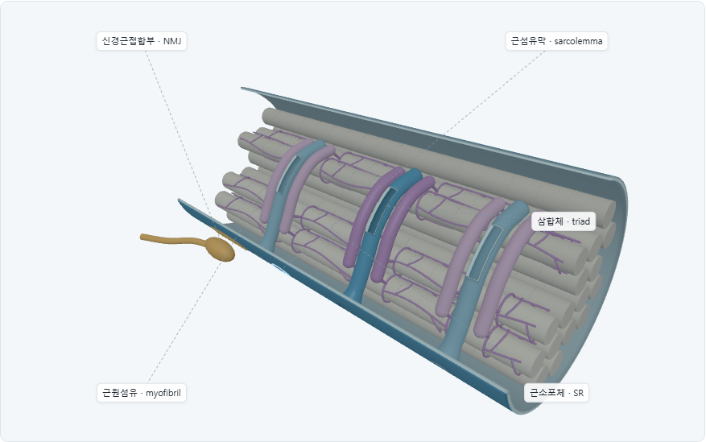
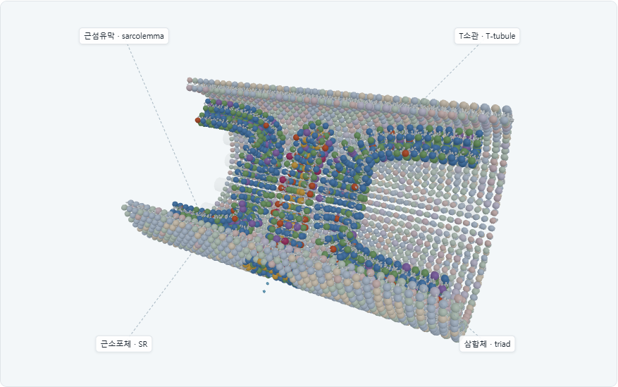
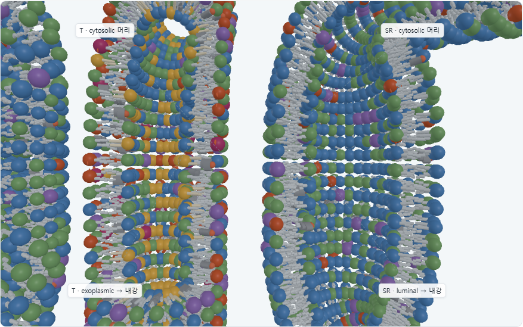

# Cell Interior · 인지질 이중층 중심 재설계

검증일: 2026-10-03 (Asia/Seoul). **Commit / push 없음.** 기존 미커밋 작업 위에서 이번 요청 범위의 구현을 수정했습니다.

## 목적과 수정 전후

기존 화면은 파란 단일 외피, 청록색 T소관, 보라색 SR 관·철망과 다수의 근원섬유가 중심이었습니다.
막 사이 공간은 있었지만 인지질 머리·꼬리는 이 화면에 없었고, NMJ가 기본 라벨의 첫 항목이었습니다.
이는 Lipid Explorer의 핵심인 ‘같은 지질 이중층이 휘고 구획을 만든다’를 직접 보여주지 못했습니다.

수정 후에는 모든 보이는 막을 **두 leaflet의 인지질**로 그립니다. 기존 막 조각의 분자 부품과 색을
공유하고, 곡면의 법선 방향에 맞춰 회전시킵니다. 근원섬유는 저대비 배경으로 줄였고 NMJ/흥분 전달은
접힌 보조 관찰로 이동했습니다. 막 종류 자체를 파랑/보라 solid surface로 구분하지 않습니다.

| 수정 전 | 수정 후 |
| --- | --- |
|  |  |
| 매끈한 외피와 원섬유, 선으로 보이는 SR | 반복되는 지질 머리와 두 꼬리로 이루어진 막계 |

수정 전 [Triad](before/desktop-10-triad.png)는 세 색 관이었고,
수정 후 [Triad](after/desktop-triad.png)는 각 이중층의 절개면과 빈 내강, 두 세포질 틈을 보여줍니다.

## 구현

| 항목 | 구현 및 검증 |
| --- | --- |
| Sarcolemma | 원통 곡면의 모든 표시 영역에 exoplasmic/cytosolic 두 leaflet 배치. 머리 평면은 중심면에서 ±0.34 모형 단위. 단일 wall mesh 없음 |
| 지질 재사용 | `buildLipid`의 구형 head geometry, 지질별 색, 두 개의 3-segment tail, 인산/골격, 콜레스테롤 OH·고리·꼬리 추출. 전체 세포·막 조각 생성기는 그대로 사용 |
| Curved orientation | 표면의 두 접선에서 수치 법선을 얻고 leaflet의 물 방향으로 부호 결정. 로컬 +Y는 물, −Y는 두 꼬리 방향. 꼬리 길이만 모형 두께에 맞추며 머리는 구형 유지 |
| Sarcolemma → T | 원통 표면의 열린 입구 → 둥근 funnel → 굽은 관의 연속 sampling chart. Funnel/T 경계 좌표 오차 0, 경계 법선 내적 최솟값 0.9914. 입구 cap 없음 |
| T leaflet | Exoplasmic 머리는 관 내강, cytosolic 머리는 관 밖 세포질로 향함. 세포 깊이와 무관하게 방향 보존 |
| T lumen | 속을 채우는 cylinder 없음. 앞 벽 일부만 관찰용으로 절개하여 내강과 head–tail–head 단면 노출. 세포외 공간과 동일한 파란 물 마름모 사용 |
| SR bilayer / lumen | T계와 별개 곡면에 cytosolic/luminal 두 leaflet. 고유 내강에는 연보라 공간 표지. 보라색 wire/rail/solid tube 없음 |
| Terminal cisterna | SR 관의 중심선과 반지름을 연속적으로 바꾸어 국소적으로 확장. 좁은 SR과 넓은 종말수조 사이에 별도 막·cap 없음 |
| Triad | SR — cytosolic gap — T — cytosolic gap — SR. 가장 큰 far 머리 반지름까지 포함한 보수적 중심 접합 틈은 양쪽 각각 최소 0.3724 모형 단위. 머리는 틈 쪽, 꼬리는 각각 자기 막 안쪽 |
| Plasma composition | 기존 outer/inner mix와 같은 PC/SM 대 PE/PS/PI/PIP2 선호를 유지. 반대 leaflet의 희소 표본도 포함해 100% 독점으로 표시하지 않음 |
| SR composition | 별도 PC/PE 중심의 표본 가중치와 더 적은 콜레스테롤. PM의 비대칭성을 복사하지 않음. SR의 정확한 비율·완전한 대칭·특정 지질의 부재는 주장하지 않음 |
| 비교 기능 | ‘막 종류 비교’에서 T와 SR의 색 구성·콜레스테롤 표식 및 두 설명을 함께 표시 |
| 카메라 | 전체 → T 입구 → 개별 지질 → 기존 막 조각. Sarcolemma 단면, SR 관·내강, cisterna, triad와 접합 틈 preset 추가 |
| 전환 | 2.6초 동안 곡면에 접근하며 local LOD를 높이고 머리·꼬리를 확인한 뒤 기존 막 조각으로 전환. Reduced-motion은 즉시 전환 |
| 배경 | 근원섬유 5개, opacity 0.16, 띠/수축 detail 생략. NMJ는 기본 숨김. 확대 시 주변 막을 생략한다는 설명 제공 |

## LOD · batching · 측정

각 system의 head, bead, tail, sterol plate를 묶어 **2 × 4 = 8 InstancedMesh**로 그립니다.
기본 장면 전체는 14 mesh이며 일부는 숨긴 NMJ/보조 강조입니다. 인지질마다 Mesh를 생성하지 않습니다.
모드 변경과 확대에서 instance buffer를 재사용하며, 카메라 거리·관심 영역이 변할 때만 내용을 갱신합니다.

- **Far:** 중첩 표본의 1/4 정도, 큰 구형 머리와 두 꼬리 유지. Solid surface 대체 없음.
- **Medium:** 표본 증가, 인산/골격 등 추가 부품 포함.
- **Near / Triad focus:** 초점 주변 전체 표본과 전체 분자 부품. 멀리 떨어진 막은 낮은 LOD 유지.
- Desktop의 전체 표본은 인지질 22,920 + 콜레스테롤 2,431. Compact는 인지질 16,070 + 콜레스테롤 1,730.
  모두를 한꺼번에 렌더하지 않으며 이 수는 생물학적 molecule count가 아닙니다.

| 장면 | 수정 전 draw calls / triangles | 수정 후 draw calls / triangles | 표시 지질 기호 수 | 최종 FPS / p95 |
| --- | --- | --- | --- | --- |
| Desktop 기본 | 39 / 234,032 | 11 / 1,739,884 | 6,373 | 300.1 / 3.4ms |
| Desktop Triad | 36 / 232,952 | 10 / 2,134,280 | 6,044 | 300 / 3.4ms |
| 390px 기본 | 39 / 123,800 | 11 / 1,064,816 | 4,516 | 300.1 / 3.4ms |

분자 표현으로 **삼각형 수는 증가**했습니다. Draw call 감소를 GPU 작업량이나 모든 기기의 속도 개선으로
해석하지 않습니다. 수치는 설치된 Chrome headless, desktop 1440×1150 / mobile 390×844 viewport에서
실제 RAF 간격 30프레임 준비 후 120프레임으로 측정했습니다. 모바일은 터치·viewport 모사이며
실물 휴대폰 측정은 아닙니다. 최종 측정 원본은 [browser-report.json](regression/browser-report.json)입니다.

## 요청된 14개 화면 · 직접 확인

| 번호 | 화면 | 판정 / 증거 |
| --- | --- | --- |
| 1 | Cell Interior 기본 | PASS · [기본](after/desktop-overview.png), [설명 포함](after/desktop-overview-layout.png) |
| 2 | Sarcolemma close-up | PASS · [구형 머리 표면](after/desktop-sarcolemma.png) |
| 3 | Sarcolemma bilayer cross-section | PASS · [머리–꼬리–머리](after/desktop-cross-section.png) |
| 4 | T-tubule entrance | PASS · [곡면에서 입구로](after/desktop-tubule.png) |
| 5 | T-tubule curved bilayer | PASS · [곡면의 개별 머리와 두 꼬리](after/desktop-membrane-zoom.png) |
| 6 | T-tubule lumen | PASS · [내강과 파란 마름모](after/desktop-lumen.png) |
| 7 | SR tubule | PASS · [막관의 단면](after/desktop-sr.png) |
| 8 | SR lumen | PASS · [별도 내강과 연보라 표지](after/desktop-sr-lumen.png) |
| 9 | Terminal cisterna | PASS · [같은 SR 관의 확장부](after/desktop-cisterna.png) |
| 10 | Triad 전체 | PASS · [세 이중층](after/desktop-triad.png) |
| 11 | Triad membrane close-up | PASS · [두 cytosolic leaflet과 접합 틈](after/desktop-triad-detail.png) |
| 12 | Cell Interior → membrane zoom | PASS · [전환 중](regression/desktop-13-interior-to-patch.png), [기존 막 조각 도착](regression/desktop-patch-result.png) |
| 13 | Mobile Cell Interior | PASS · [390px](after/mobile-overview.png), [320px 조작](regression/mobile-320-interior.png) |
| 14 | Mobile Triad | PASS · [390px](after/mobile-triad.png), [320px](regression/mobile-320-triad.png) |

추가로 [막 종류 비교](after/desktop-compare-layout.png), 회전 전후, 보조 NMJ/흥분 전달,
접힌 설명, 화면 크기 변경, 라벨·터치 조작도 검사했습니다.

### 14개 판정 질문

| 판정 질문 | 결과 | 근거 |
| --- | --- | --- |
| Sarcolemma가 phospholipid bilayer로 보이는가? | YES | 단면의 두 구형 머리 층과 꼬리 |
| T-tubule이 bilayer로 보이는가? | YES | 내강 창 양쪽의 두 leaflet |
| SR이 bilayer로 보이는가? | YES | SR 관과 내강 확대 |
| Terminal cisterna도 bilayer인가? | YES | 같은 SR 표면의 확장부 |
| T-tubule과 sarcolemma가 연속인가? | YES | 입구 화면 + chart 경계 좌표 검사 |
| T lumen과 extracellular space가 연속인가? | YES | 열린 입구, 연결된 물 표식, cap 없는 geometry |
| SR lumen이 별도 공간인가? | YES | 독립 표면과 SR 내강 표식 |
| Triad 막들이 융합하지 않는가? | YES | 실제 head envelope 사이 양수 gap |
| 곡률에 따라 orientation이 변하는가? | YES | 실제 인스턴스 법선·행렬 검사 |
| 가까이에서 head/tail을 구분하는가? | YES | 단면과 개별 지질 확대 |
| 멀리서도 lipid 흔적이 남는가? | YES | 기본 화면의 반복 구형 머리, far의 두 꼬리 |
| Myofibril보다 막이 주인공인가? | YES | 저대비 배경과 막 중심 화면 |
| NMJ보다 막이 주인공인가? | YES | 기본 NMJ 숨김 |
| 기존 막 조각과 같은 시각 언어인가? | YES | 같은 `buildLipid` 부품·색을 직접 재사용 |

## 자동 검사와 회귀

- `node scripts/qa/check-interior.mjs`: **PASS**. Desktop/compact에서 seam 좌표, normal 연속성,
  각 leaflet의 방향, SR/T 간격, 실제 head/tail 행렬, 구형 머리, 조성 차이, LOD와 버퍼 재사용 검증.
- `node scripts/qa/check-cell.mjs`: **PASS**. Whole Cell 지질 수·방향·분포·PS 총량 보존·단면·선택·재현성,
  Orbit 터치/pinch/회전/확대 제한과 전환 잠금.
- `node scripts/qa/check-molecules.mjs`: **PASS**. 기존 7종 지질의 원자 구조 검사.
- `check-interior-browser.mjs`: **PASS**, 29개 기록 항목 / 35개 화면. Console/runtime/network 오류 0.
  Whole Cell/단면, 막 조각/비대칭성/PS, 캔버스 선택, 7종 모두 3D/2D, 원래 스케일 복귀, Reset,
  라벨/회전 설정, 전환 중 입력 잠금·탭 전환, 390/320px overflow·44px 터치 목표,
  pinch, reduced-motion, Module 2/3 조작을 포함합니다.
- `capture-bilayers.mjs`: 최종 focus 화면 14개 + layout 캡처. Runtime 오류 0.

## 변경 파일

| 파일 | 변경 목적 |
| --- | --- |
| `scripts/core/cell-interior.js` | 연속 곡면·함입·SR 확장부·관찰창·물 표식·카메라·보조 NMJ |
| `scripts/core/curved-bilayer.js` | 공통 지질 부품 추출·법선 회전·leaflet 배치·LOD·8개 instance batch |
| `scripts/core/membrane-composition.js` | 기존 조성에 근거한 Interior PM 모델과 별도 SR 모델 추가 |
| `scripts/modules/membrane.js` | 막 중심 모드·라벨·설명·카메라와 LOD 연결·기존 막 조각 전환 |
| `index.html`, `styles/app.css` | 관찰 버튼·조성 비교·접힌 보조 기능·단순화 안내 |
| `scripts/qa/check-interior.mjs`, `scripts/qa/check-bilayers.mjs` | 새 분자 geometry 검사와 기존 실행 진입점 |
| `scripts/qa/check-interior-browser.mjs`, `scripts/qa/capture-bilayers.mjs` | 새 화면 캡처와 기존 기능 회귀 |
| `README.md`, `docs/SCIENTIFIC_NOTES.md` | 현재 구현·실행법·과학적 범위와 근거 |
| `docs/qa/membrane-interior/` | 수정 전/후 화면, 원본 측정, 이 보고서 |

기존 `browser-metrics.js`의 미커밋 변경은 보존하여 활용했습니다. 기존 지질 생성기, Whole Cell,
원자 구조 모델, Viewer와 Module 2/3 구현 파일은 이번 작업에서 변경하지 않았습니다.

## 남아 있는 교육적 단순화

인지질·콜레스테롤 기호는 실측 분자 크기·수·비율이 아닙니다. 막 두께와 접합 틈을 확대했으며
꼬리 길이와 머리 크기의 상대 비율도 조정했습니다. 성긴 표본 사이의 틈은 실제 막의 구멍이 아닙니다.
앞 벽의 절개와 잘린 관 끝은 관찰용이고, 확대에서는 주변 막을 생략합니다. SR의 두 대표 가지는
관찰 범위 밖에서 연결된 것으로 단순화했습니다. 실제 근육 전체의 망상 구조와 반복 triad, 막단백질,
분자 동역학, 실제 칼슘 이동·수축은 구현 범위가 아닙니다. SR 조성은 PC/PE 중심의 예시이며,
정량적 leaflet 비대칭이나 생물학적 완전 부재를 주장하지 않습니다.

과학적 설명과 문헌은 [SCIENTIFIC_NOTES.md](../../SCIENTIFIC_NOTES.md)에 기록했습니다.
